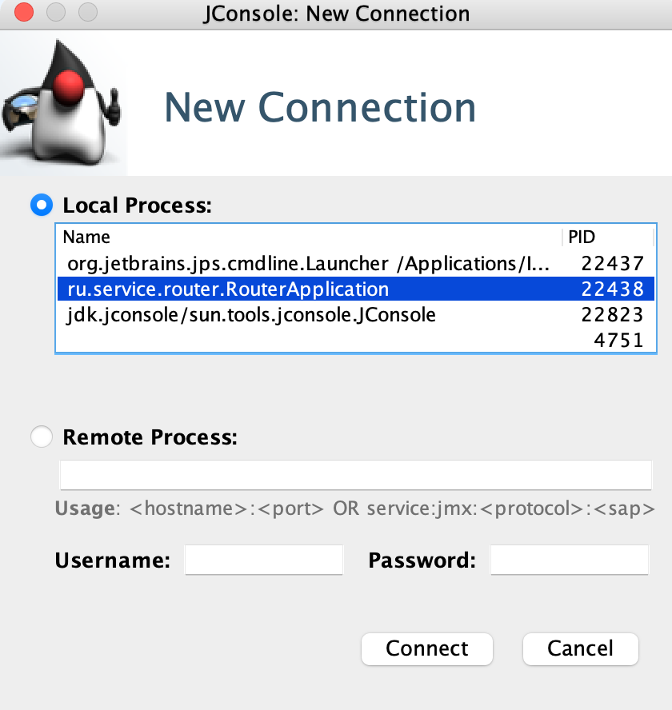
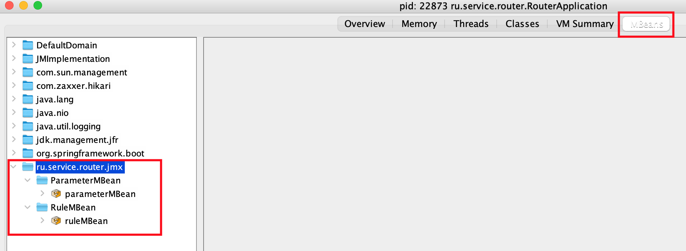
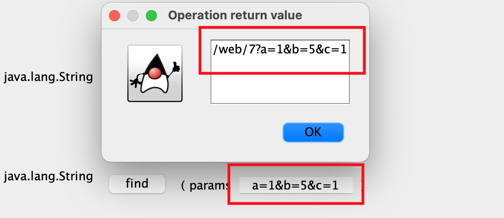
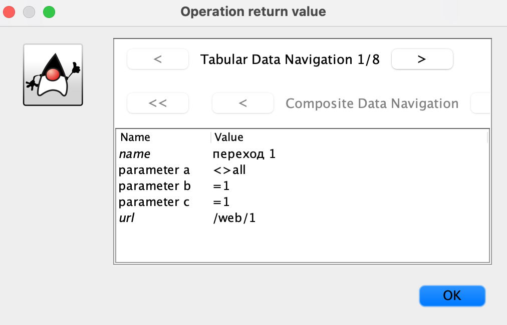

## REST

### Получить правило по id (GET)

`http://localhost:8080/rule/1`

### Найти правило по параметрам (GET)

`http://localhost:8080/rule/find?a=5&b=777&c=1`

### Добавить правило (POST)

**url**

`http://localhost:8080/rule/add`

**json**

`{
"name": "test rule",
"url": "/test/1",
"parameters": [
{
"name": "a",
"values": [
{
"value": 111,
"comparisonType": "EQUAL"
}, {
"value": 222,
"comparisonType": "NOT_EQUAL"
}
]
}, {
"name": "b",
"values": [
{
"value": 333,
"comparisonType": "EQUAL"
}
]
}
]
}`

### Изменить правило (PUT)

**url**

`http://localhost:8080/rule/1`

**json**

`{
"name": "test rule",
"url": "/test/1",
"parameters": [
{
"name": "c",
"values": [
{
"value": 111,
"comparisonType": "EQUAL"
}, {
"value": 222,
"comparisonType": "NOT_EQUAL"
}
]
}, {
"name": "b",
"values": [
{
"value": 333,
"comparisonType": "EQUAL"
}
]
}
]
}`

**Важно**

В запросе должны присутствовать как новые параметры, так и старые. Если передать только новые параметры, то старые буду удалены

### Удалить правило (DELETE)

`http://localhost:8080/rule/9`

### Получить все правила (GET)

`http://localhost:8080/rule`

### Получить параметр по id (GET)

`http://localhost:8080/parameter/1`

### Создать параметр (POST)

**url**

`http://localhost:8080/parameter/add`

**json**

`{
"name": "d",
"type": "STRING",
"description": "Параметр «d»",
"rank": 5 }`

### Изменить параметр (PUT)

`http://localhost:8080/parameter/6`

### Удалить параметр (DELETE)

`http://localhost:8080/parameter/6`

### Получить все параметры (GET)

`http://localhost:8080/parameter`

## JMX

Для подключения к jconsole, вводим в терминале

`jconsole`

Выбираем приложение

`ru.service.router.RouterApplication`

На вкладке MBeans доступны наши бины

### Добавить/изменить правила

`{
"name": "test rule",
"url": "/test/1",
"parameters": [
{
"name": "a",
"values": [
{
"value": 111,
"comparisonType": "EQUAL"
}, {
"value": 222,
"comparisonType": "NOT_EQUAL"
}
]
}, {
"name": "b",
"values": [
{
"value": 333,
"comparisonType": "EQUAL"
}
]
}
]
}`

### Поиск правил по параметрам

`a=1&b=5&c=1`

### Получить все правила (GET)

